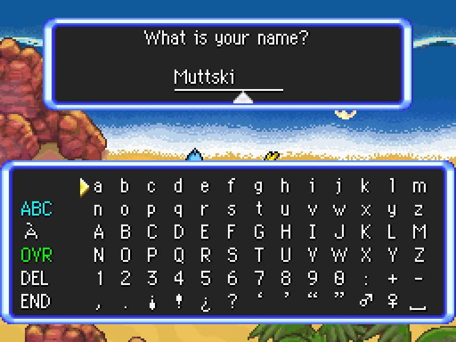

# Skypatch template
Autofills the hero name using the default name, in the same way Poképals is autofilled for the team name. A niche-ish patch for GinnieH20, based on code I had previously written for [EoS Archipelago](https://github.com/Chesyon/eos-archipelago-patches/blob/main/src/name_autofill.s).

## The technical details
The hero and team name menus both use the same underlying function for their keyboard; `SetupAndShowKeyboard`. If the second and third parameters are set to a pointer to text (no clue why there's two separate ones, I haven't checked), it'll autofill that text into the keyboard. In the case of the team name, `PreprocessStringFromId` is used to put "Poképals" into a buffer on the stack, and that stack address is passed into `SetupAndShowKeyboard`. Normally, the hero name uses a null pointer, but we instead hook, use `strncpy` to get the hero name from somewhere else in RAM (it's right next to the default hero ID, but it only actually gets loaded there when the team is initialized) and copy it into the stack. We *could* in theory just use that string directly without copying it, but then you're actually modifying that string, which could have unforseen consequences if you need to use it again later. I found this out the hard way after the original version in EoS Archipelago, where I *did* just use the original string. I don't actually remember what broke, but something broke, and I'm not gonna risk that a second time.
