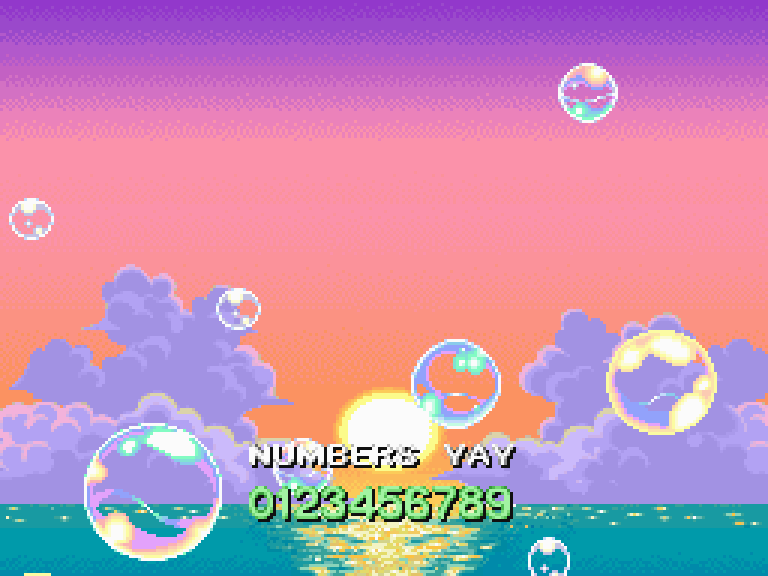

# NumbersInCredits
Allows the credits font to properly display numbers.

## Credits
This patch was originally written by [Adex](https://github.com/Adex-8x) for *MysteryMail Rehearsal* based on his own research, using [a mix of C and ASM](https://github.com/Adex-8x/mmr-patches/commit/155ad4712958cf8dea7d549ab844dcd5349d70af). I (Chesyon) ported it to a skypatch with permission, added compatibility for EU/JP, and optimized the code for assembly.

## The technical details
EoS *has* glyphs for 0-9 in its credits font, but the code responsible for getting glyphs just says "no thanks." Thanks, Chunsoft. The 0x2026f4c [EU] function is VERY annoyingly complicated, and I still don't understand all of it as of writing. I only really researched what I needed to to get EU working (more on that at the bottom). Throughout most of the function, r3 holds the character, and it checks if that character falls in certain ranges to determine what behavior to perform. Normally, the 0-9 characters won't fall into any valid range, the function will return 6, which probably means 'invalid', and the character won't show up. We hook right before it would return invalid, and we check one more range; 0x30 through 0x39, which represent 0-9. If r3 still isn't in that range, we can go ahead and treat the character as invalid as the game originally planned. Otherwise, we'll calculate the index of the character in `staffont.dat` by adding 0x10 (the indexes in staffont are 64-73, or 0x40 thru 0x49, and 0x30+0x10=0x40). Once we have the index, we jump over the code to handle 'valid' characters and let it do its thing.

### Why have them in the font if they can't even be used?
┐('～\`*)┌
Chunsoft moment, probably. Since `staffont.dat` doesn't follow any particular character encoding (to my knowledge), all the logic for getting the index of any character had to be done by hand, hence all the weird stuff in this function. Since numbers never actually get used anywhere in the vanilla credits, I wouldn't be surprised if they just removed that piece of the logic (or never even wrote it) as some kind of tiny optimization. As for why they didn't bother to remove the glyphs from the font, I have no clue. Too much hassle, maybe? Not that I'm complaining.

### EU angers me
The (relevant parts of the) logic are identical between US and JP, but EU decided to get a bit quirky. There's some extra range checks that took me embarassingly long to figure out how to write around. Ultimately the ASM code was the same, just at different addresses, so at least I didn't have to split that up as well. I just hook after those two extra checks before it would return invalid.

