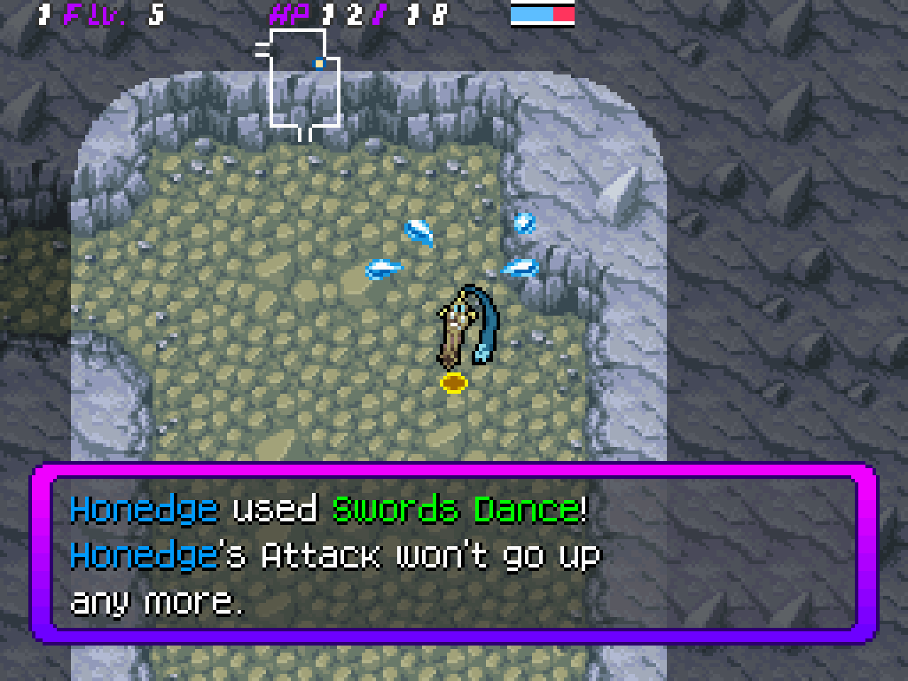

# PPAlert
Displays a notification when a move runs out of PP, like they do in more recent PMD games. By Mond and Adex, adapted into a skypatch by me.

(No technical details for this one, sorry. I didn't write the code.)
