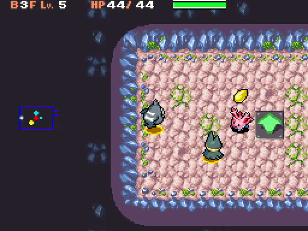

# SwapLeaderPosition
A niche-ish patch for General Snorlax. Pressing L+Y in a dungeon will swap the leader's position with the second party member (usually the partner), if possible. Incompatible with MoveShortcuts, so use with caution!

## The technical details
On a base level, this one isn't *super* complicated. There's already a function for swapping, after all! `TrySwitchPlace`, that is. That's exactly what I used here; this DOES mean that a swap would fail if either monster has the Suction Cups ability. I decided that this was fine, since the patch was intended to be niche and used in a specific hack that wouldn't have recruitment anyways. If you want to try to rewrite this such that it still works even with Suction Cups, you have my blessing, though you'd probably need to do your own implementation of `TrySwitchPlace`.

In terms of the hook, I just "borrowed" HeckaBad's hook for BetterMoveShortcuts (which... as of writing, I don't think is public, but it will be some day.) Thank you Hecka, very cool. This alone would be enough to create an incompatibility with MoveShortcuts, but the combo L+Y would also just use a move with that patch. Anyway, the hook takes advantage of poorly compiled code, optimizing a `mov r0,r8` + `str r0,[sp,#0x5C]` into a `str r8,[sp,#0x5C]` and using the freed up instruction to branch into overlay36. You might think that r0 not being assigned would cause problems, but the function call immediately after this tosses r0 immediately, so it's entirely fine.

Once we hook, we check DUNGEON_CONTROLLER_STATUS (which is *also* undocumented, and *also* stolen from Hecka, but it's okay because I think its existence has technically been known for a while) to see if L is held and Y is tapped. If it is, we get the second entity from the entity table, and the leader entity which was already in r6 going in, and start doing stuff. By stuff, I mean calling `TrySwitchPlace` to swap, `PlaySeByIdVolumeWrapper` to play the sound effect, and `SubstitutePlaceholderStringTags` followed by `LogMessageByIdWithPopup` to display the text. That part's pretty simple.
