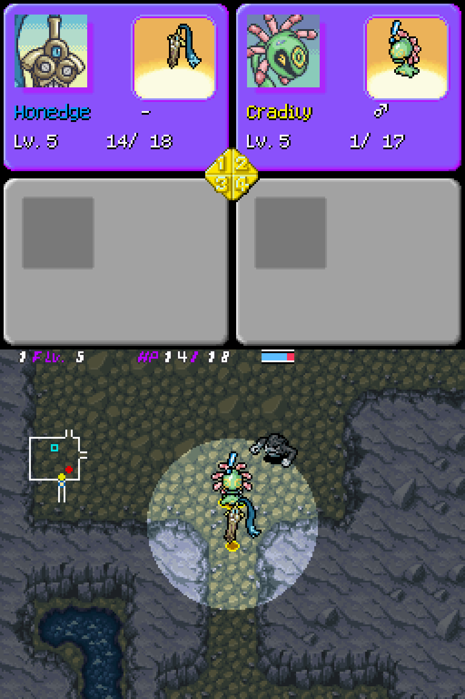
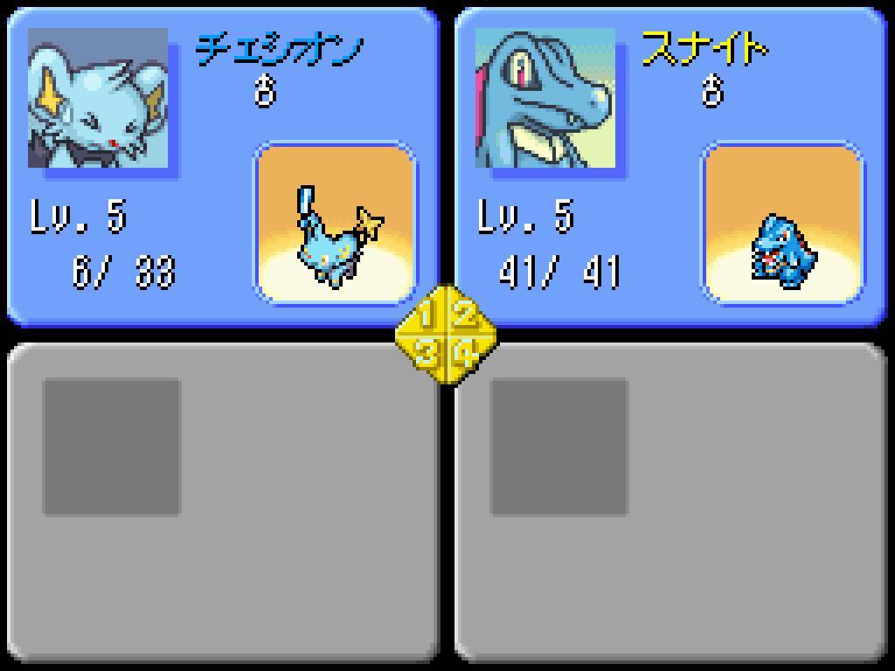

# TeamStatsPain
Updates a party member's portrait to use the Pain portrait when in critical condition, if the portrait is available.

## Wait, isn't this one already in SkyTemple?
Yes*. It was added in 1.8.4, but I made a small oopsies[^1] when writing it, making the patch impossible to apply. TeamStatsPain_hotfix.skypatch is effectively the exact same as what's in SkyTemple, but with that one mistake fixed.

## The technical details
This one's a fun one! It was also my first proper skypatch (you can tell because EVERY line of ASM has long comments), and I'm very proud of it.
The interesting thing is that this *doesn't* actually directly check for critical condition! I haven't been able to find a consistent way to go from a party_member struct to an entity struct.
For most cases you could just access the first four indexes of the entity table, but this breaks when monsters are recruited to/leave the party mid-floor[^2].
(This is also the reason why I can't easily expand this patch, but I'll get back to that.)
Since we can't access the entity struct, we can't check for critical condition directly. What I **do** have access to is the current HP and max HP on the monster, since that IS in the party_member struct.
So what I did was just check if the current HP was less than or equal to a quarter of max HP, which is effectively how the game determines critical condition anyways.
This is how we check for critical condition without *actually* checking for critical condition!

A weird side effect of this approach: I'm not sure if this is a vanilla bug or just weird game design, but the critical condition status sticks around for a turn longer than it should.
In other words, the monster will still have the critical condition for a turn after going above 1/4 max HP. However, TeamStatsPain does *not* follow this logic, and the Pain portrait goes away as soon as HP goes above 1/4 max.
As a result, the Pain portrait will go away a turn before the critical status does. Nothing game-breaking, just an odd visual quirk. The code would get FAR too complicated if I implemented the one-extra-turn logic, so I chose to just leave it.

### Could this be expanded to allow for other portraits?
Not easily. As explained above, I'm not actually able to check the monster's statuses.
If I had a consistent way to get the entity struct for each team member, I would absolutely be interested in rewriting this to directly check statuses and update the portraits based on that.

[^1]: The `overlay/` was missing from line 15 of [config.xml](https://github.com/Chesyon/chesyon-eos-asm/blob/main/skypatches/TeamStatsPain/config.xml#L15), meaning SkyTemple couldn't find overlay10 when patching.
[^2]: See [this message](https://discord.com/channels/710190644152369162/1304094562196787253/1304267537252352073) in the SkyTemple Discord's #support channel for a video demonstration of this issue.